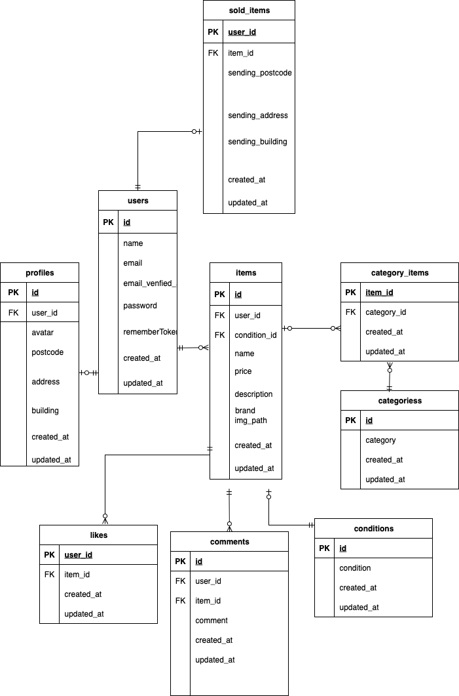

# COACHTECHフリマ
　・アイテムの出品と購入を行うためのフリマアプリ
　・機能や画面がとてもシンプルで扱いやすくなっていま　す。

## 環境構築
**Dockerビルド**
1. `git clone git@github.com:git@github.com:Estra-Coachtech/laravel-docker-template.git
2. cd contact-form
3. DockerDesktopアプリを立ち上げる
4. `docker-compose up -d --build`

> *MacのM1・M2チップのPCの場合、`no matching manifest for linux/arm64/v8 in the manifest list entries`のメッセージが表示されビルドができないことがあります。
エラーが発生する場合は、docker-compose.ymlファイルの「mysql」内に「platform」の項目を追加で記載してください*
``` bash
mysql:
    platform: linux/x86_64(この文追加)
    image: mysql:8.0.26
    environment:
```

**Laravel環境構築**
1. `docker-compose exec php bash`
2. `composer install`
3. 「.env.example」ファイルを 「.env」ファイルに命名を変更。または、新しく.envファイルを作成
4. .envに以下の環境変数を追加
``` text
DB_CONNECTION=mysql
DB_HOST=mysql
DB_PORT=3306
DB_DATABASE=laravel_db
DB_USERNAME=laravel_user
DB_PASSWORD=laravel_pass
```
5. アプリケーションキーの作成
``` bash
php artisan key:generate
```

6. マイグレーションの実行
``` bash
php artisan migrate
```

7. シーディングの実行
``` bash
php artisan db:seed
```
8. シンボリックリンク作成
``` bash
php artisan storage:link
```

## 使用技術(実行環境)
- PHP8.3.0
- Laravel8.83.27
- MySQL8.0.26

## ER図


## URL
- 開発環境：http://localhost/
- phpMyAdmin:：http://localhost:8080/


## 管理者・一般ユーザーのログイン情報

### 一般ユーザー
- メールアドレス：test@example.com  
- パスワード：password

## 📄 エラーメッセージ

 住所変更ページであるaddress.blade.phpでのエラーメッセージはAddressRequestで示している
 ーエラーメッセージ内容ー
 ・郵便番号を入力していない場合：郵便番号を入力してください。
 ・郵便番号を正規表現できていない場合：郵便番号はハイフンありの8文字（例：123-4567）で入力してください。
 ・住所を入力していない場合：住所を入力してください。

 
 
 商品詳細ページであるshow.blade.phpでのエラーメッセージはCommentRequestで示している
 ーエラーメッセージ内容ー
 ・コメントを入力していない場合：コメントを入力してください
 ・コメントが255文字以内で入力されていない場合：コメントは255文字以内で入力してください

 
 
 出品ページであるcreate.blade.phpでのエラーメッセージはExhibitionRequestで示している
 ーエラーメッセージ内容ー
 ・商品名を入力していない場合：商品名を入力してください。
 ・商品説明を入力していない場合：商品説明を入力してください。
 ・商品説明を255文字以内で入力していない場合：商品説明は255文字で入力してください。
 ・商品画像をアップロードをしていない場合：商品画像をアップロードしてください。
 ・商品画像は.jpegまたは.png形式でアップロードされていない場合：商品画像は.jpegまたは.png形式でアップロードしてください。
 ・商品カテゴリーを選択していない場合：商品のカテゴリーを選択してください。
 ・カテゴリーの形式が正しくない場合：カテゴリーの形式が正しくありません。
 ・カテゴリーIDが無効の場合：カテゴリーIDは無効です。
 ・選択したカテゴリーが存在しない場合：選択したカテゴリーが無効です。
 ・商品の状態を選択していない場合：商品の状態を選択してください。
 ・商品価格を入力していない場合：商品価格を入力してください。
 ・商品価格を数値で入力していない場合：商品価格は数値で入力してください。
 ・商品価格を0円以上で入力されていない場合：商品価格は0円以上で入力してください。

 
 
 プロフィール設定ページであるedit.blade.phpでのエラーメッセージはProfileRequestで示している
 ーエラーメッセージ内容ー
 ・プロフィール画像は.jpegまたは.png形式でアップロードしてください。
 ・ユーザー名を入力していない場合：ユーザー名を入力してください。
 ・ユーザー名を20文字以内で入力していない場合：ユーザー名は20文字以内で入力してください。
 ・郵便番号を入力していない場合：郵便番号を入力してください。
 ・郵便番号を正規表現していない場合：郵便番号はハイフンありの8文字（例：123-4567）で入力してください。
 ・住所を入力していない場合：住所を入力してください。

 商品購入ページであるpurchase.blade.phpでのエラーメッセージはPurchaseRequestで示している
 ーエラーメッセージ内容ー
 ・支払い方法が選択されていない場合：支払い方法を選択してください


##ルート

ルート内容ーーーーーーーーーーーーーーーーーーパスーーーーーーーーーーーーーーーーーーメソッドーコントローラーーーーーーアクションーーーーーー備考

メール認証通知画面                       /email/verify                     GET     匿名関数              view.               認証必須
メール認証完了処理                       /email/verify/{id}/{hash}         GET     匿名関数              $request->fulfill()   認証必須
確認メール再送信                        /email/verification-notification   POST    匿名関数              sendEmailVerificationNotification       認証必須
マイリスト直接アクセス                   /mylist                            GET     ItemController       index       認証必須（おすすめとは別URL）
Stripe成功コールバック                  /purchase/{item_id}/success        GET     PurchaseController   success         追加（Stripe用）
Stripeキャンセルコールバック             /purchase/{item_id}/cancel         GET     PurchaseController   cancel       追加（Stripe用）
コメント投稿                           /item/{item_id}/comment            POST    CommentController    store       認証必須
ログアウト                             /logout                            POST    匿名関数               -       認証必須
メール認証済み後プロフィールリダイレクト    /email/verify/{id}/{hash}          GET     匿名関数              リダイレクト    （上と重複機能）


##stripe
 購入の際のstripeで使うテスト用のカード情報
 ーカード情報ー
 4242 4242 4242 4242
 0131
 424
 SHOTA KUSUMOTO


 #マイグレーション
 add_avatar_to_users_table.php

#メール認証
メール認証誘導画面ではmailhogを実装しています。


